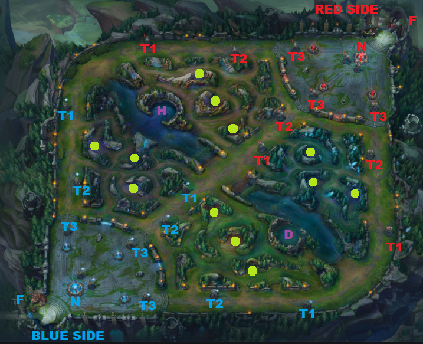

```{r setup, include=FALSE, eval=FALSE}
install.packages('tidyverse')
install.packages('car')
install.packages('ggcorrplot')
install.packages("kableExtra")
```
```{r, include=FALSE}
library(dplyr)
library(car)
library(ggplot2)
library(ggcorrplot)
library(knitr)
library(kableExtra)
```

Keywords: logistic regression, League of Legends, Early game advantage

# Abstract

Winning a game of League of Legends is difficult and requires a great amount of decision making. While there so many things to do in the game, it is common to see players not know what to prioritize and that will often cause them to fall behind in the game. Particularly in the first 10 minutes of the game, it is important to get an early lead over the opponent to secure big objectives later on. We studied the data collected from over thousands of high-ranked (Diamond+) games. By using the logistic regression to predict the whether a team will win based on what they have accomplished, we found out that while there are many aspects to the game that can make a team stronger, there is only so much that can be done in the given time and teams will need to prioritize primarily dragons to maximize their advantage over the other team.


# Introduction

If you have played or looked at any video games recently, you may have heard of League of Legends. League of Legends (LoL) is one of the most popular online multiplayer games with an enormous e-sports scene. Chances are that you have played the game before, or you may know people that play the game, or you may be curious on what this game is all about. LoL is a strategic game that involves a great amount of teamwork and coordination. While games typically last 20-40 minutes, the first 10 minutes of the game (the early game phase) is arguably the most important part of the game because it sets up small advantages that snowball into large advantages, ultimately leading to victory. Besides teamwork, a challenging part of the game is decision making. Every game is different and players will need to adapt to various situations. From all the mechanics the game has to offer, it is often difficult to decide what to do next. By analyzing the data of previous games, we will research about what are the general goals and actions that should be prioritized in the early game to get ahead. Through this study, you will improve your decision-making in the early game and use this knowledge to elevate your gameplay and win more games.

If you are new to LoL, or would like a brief introduction to some of the aspects of the game (relevant to early game), please refer to the Appendix (\ref{minimap}).

This report will be broken down into: a data section where the datasets are described, a model section, a results section which will show summary statistics, model performance and interesting findings, and a discussion section to interpret the findings of the model results as well as why the results are the way they came to be and what are some caveats and weaknesses to consider for future work.

# Data

```{r, echo=FALSE}
data <- data.frame(read.csv(file = "dataset/high_diamond_ranked_10min.csv"))
#data
```

## Data Collection

The data we will be using is collected from the Riot API. Riot is the company the runs LoL and every game that is played is stored to give players the opportunity to review their gameplay. This data available through their API. After filtering matches by ranks, 9879 games were randomly selected between Diamond rank to Master rank (please see the Appendix to understand the LoL ranking system). Each game is unique and has their own gameId.

After selecting the matches to study, the details of each match were organized in time-series manner and the game state at 10 minutes into the game was extracted. The game state was then consolidated into data that summarizes what each team has accomplished in the first 10 minutes of the game.

The dataset can be found here: https://www.kaggle.com/bobbyscience/league-of-legends-diamond-ranked-games-10-min

Before discussing the data itself, it is important to note the potential biases and weaknesses from this data collection. Firstly, the matches are filtered from rank Diamond to Master. This is only 2 out of the 9 divisions of the LoL ranked system so it may not be an accurate representation of the entire playerbase. In addition, these higher level divisions are where popular full-time streamers and professionals play. Since they play many ranked matches on a daily basis, it is will not be surprising to see that many of the matches in the dataset will be collected from these players, which results in the data being biased towards players that play more in these ranks. Another weakness of this data collection is that the current state of the LoL may have changed from the time the collected matches were played. Riot is constantly updating the game, whether it is to rebalance certain champions/items or releasing new game content to keep the gameplay fresh for players to enjoy. Depending on the changes made to the game, the analysis gathered from the study may not be completely relevant anymore.

The first two weaknesses involving bias towards certain ranks/players can be prevented by changing the sampling method. Instead of filtering diamond games and doing random sampling, performing a cluster sampling from each of the 9 divisions would better represent the general playerbase. However, majority of the player base are in the lower ranks (Silver/Gold) and lower-ranked games have two major issues that affects data quality. The first issue is that many high-ranked players tend to disguise themselves in lower ranked games (to play with their low-ranked friends, or to quickly rank up a low-ranked account) and they easily win those games, due to sheer player mechanic difference (mastery of the champion played, as opposed to game knowledge). Another issue is that lower-ranked games have a tendency to have people that give up on the match easily and as a result, and so unexpected outcomes happen very often. In higher-ranked games, players often choose the champions that they are comfortable with and do not give up as easily. As a result, higher-ranked games have much less variance on the individual players so it is better for getting consistent data, predict the game outcome, and obtain accurate meaningful results from the analysis. Despite some bias in the data, using Diamond+ ranked games with random sampling is preferred approach.

The population being studied is the general playerbase that play ranked and the sampling frame is rank Diamond 1 to Master which represents on about 5% of the playerbase. Apart from data quality described previously, the reason why this frame is used for representing the population is because most of the players are in Platinum/Gold ranks and many player in these ranks were previously Diamond rank from previous years or spend enough time and effort in the game to be close enough to reach Diamond rank.

## Data Characteristics

The columns of the dataset consists of the gameId, whether blue team won the game and 19 features of what the each team has accomplished (2x19 columns): # of wards placed, # of wards destroyed, first blood, # of kills, # of deaths, # of assists, # of elite monsters slain, # of dragons slain, # of heralds slain, # of towers destroyed, total gold, average level of the team, total experience (sum of all the experience every player on the team has gathered), total minions killed, total jungle minions killed, gold difference compared to the other team, experience difference compared to the other team, creep score (CS) per min, gold per min.

For this anaylsis, We will consider the game from blue team's perspective so we will only consider using features pertaining to the blue team.

The dependent variable is whether blue team won the game or lost the game.

As for the independent variables, some of the 19 features of the blue team were selected. These features are first blood, # of kills, # of deaths, # of assists, # of dragons slain, # of heralds slain, # of towers destroyed, total minions killed, total jungle minions killed, and experience difference compared to the other team. The reason why the other features have been excluded is because those features are redundant information or are stats that are not debatable for decision-making:

* wards placed, wards destroyed: vision control is not debatable because it is crucial every second of the game
* elite monsters slain: dragon and herald already accounted for
* average level of the team: total experience already accounted for
* CS per min (# of minions killed per minute): total minions killed already accounted for
* total gold, gold difference, gold per min: did not include because it suffers from multicollinearity (more details in model section)

## Data Visualization

Below are the distributions for each feature that are used for the model.

```{r, echo=FALSE}

hist(data[,2], main = "Figure A: Distribution of Blue Team Wins",xlab = "Blue Wins", col = 'blue')

hist(data[,5], main = "Figure B: Distribution of Blue Team First Blood",xlab = "Blue Team First Blood", col = 'blue')

hist(data[,6], main = "Figure C: Distribution of Blue Team Kills",xlab = "Blue Team Kills", col = 'blue')
hist(data[,7], main = "Figure D: Distribution of Blue Team Deaths",xlab = "Blue Team Deaths", col = 'blue')
hist(data[,8], main = "Figure E: Distribution of Blue Team Assists",xlab = "Blue Team Assists", col = 'blue')

hist(data[,10], main = "Figure F: Distribution of Blue Team Dragons",xlab = "Blue Team Dragons", col = 'blue')
hist(data[,11], main = "Figure G: Distribution of Blue Team Heralds",xlab = "Blue Team Heralds", col = 'blue')
hist(data[,12], main = "Figure H: Distribution of Blue Team Towers Destroyed",xlab = "Blue Team Towers Destroyed", col = 'blue')

hist(data[,16], main = "Figure I: Distribution of Blue Team Minions Killed",xlab = "Blue Team Minions Killed", col = 'blue')
hist(data[,17], main = "Figure J: Distribution of Blue Team Jungle Minions Killed",xlab = "Blue Team Jungle Minions Killed", col = 'blue')

hist(data[,19], main = "Figure K: Distribution of Blue Team Experience Difference",xlab = "Blue Team Experience Difference Compared to Red Team", col = 'blue')


#for( i in 2:21){
#  hist(data[,i], main = colnames(data)[i],xlab = colnames(data)[i], col = 'blue')
#}
```


```{r, echo=FALSE}

# pre-processing, discussed in model section
# it is done before splitting the data so this does not have to be done separately on each split
data <- data %>% mutate(blueKda = if_else (blueDeaths > 0, (blueKills + (blueAssists/2)) / blueDeaths, blueKills + (blueAssists/2)))

# splitting data, discussed in results section
testset <- data[1:1000,]
#testset
trainset <- data[1001:nrow(data),]
#trainset
```

# Model

## Model Selection
The research question is to find out which parts of the game to prioritize. One way tackle this problem is to individually plot each feature against the dependent variable and compare them with other features (eg. plotting "Win Percentage to Number of Dragons" and comparing it to "Win Percentage to Number of Heralds"). While this is a simple direct way to compare which objectives have the highest winrate, this is not necessarily the objectives to prioritize in the early game. For example, in a game of chess, usually the player who captures the most pieces would win the game but this does not happen without a solid opening, development of their pieces, etc. The same concept applies to LoL. Due to the large number of features and how the game is based on snowballing advantages (eg. getting kills in bot lane leads to an advantage in bot lane which leads to securing dragons), it is difficult to determine whether an individual aspect of the game was the major factor to victory, or it is just a by-product of the other advantages the team has gained. Furthermore, this method only works best under the assumption that each feature is independent of one another which is definitely not the case in LoL.

With this in mind, the better approach is to consider all the relevant features together, plot it against the dependent variable and then compare individual weightings to determine the impact of each feature. To do this, we will use a binary logistic regression model to predict whether a team wins based on what the team has achieved throughout the first 10 minutes of the game. An advantage to using logistic regression is that model coefficients can be easily interpreted because the coefficient magnitude indicates the importance of a feature on the dependent variable and it also shows positive/negative associations. It is also able to model handle several inputs easily, which applies to our use case as we want to study several features at once. However, one caveat with using several features in logistic regression is to watch out for multicollinearity.

## Multicollinearity

Multicollinearity occurs when independent variables are too correlated with one another. Although this does not affect the predictive ability of the model, it makes coefficient estimates less accurate. As a result, it is more difficult to do inference of the estimates when multicollinearity is present. As mentioned in the data section, the three features pertaining to gold acquired (total gold, gold difference, gold/min) were excluded because of multicollinearity. These features are correlated to champion kills, minions, jungle minions and experience difference. This can be verified by viewing the correlation matrix ( higher value means higher correlation between the two variables indicated on the column and the row of the entry):

```{r, echo=FALSE}
#vifLogit <- vif(logit)
#vifLogit
#barplot(vifLogit, main = "VIF Values", horiz = TRUE, col = "steelblue")

kdaGoldExp <- data[,c("blueKda", "blueGoldDiff", "blueExperienceDiff", "blueHeralds", "blueDragons", "blueFirstBlood", "blueTotalMinionsKilled", "blueTotalJungleMinionsKilled")]
cor <- round(cor(kdaGoldExp), 1)
ggcorrplot(cor, hc.order=TRUE, outline.col="white", lab=TRUE, title="Correlation Matrix of Blue Team Features")
```

As shown in the correlation matrix, the experience difference and gold difference have an unhealthy correlation score of 0.9. This is because a player primarily gains gold and experience from the same sources: minions and/or jungle minions. As such, experience difference and gold are have an unhealthy correlation for the model and so the features directly related to gold were excluded. Experience was chosen over gold because experience gain is only limited to hunting minions and jungle minions which is easier to analyze player decision making, compared to gold which can be gained in other different ways (destroying towers, champion kills, etc.).

## Input discussion and adjustments (KDA)

One data pre-processing done is to consolidate a team's kills/deaths/assists into a value called into a KDA ratio. For this analysis, the KDA will be calculated as (kills+(assists/2))/deaths. The reason why assists is halved is because the gold obtained from assists is half of the kill gold and for the first ten minutes of the game, there is on average 1 assist per kill. So assuming there is one assist per kill, then for every two assists, a kill's worth of gold should be awarded.
This KDA calculation is more useful than individual values of kills, deaths, assists because it gives a better representation of the advantages/disadvantages that occurred in previous fights in the game. For example, knowing that a team has 4 kills is not useful enough to gauge if it has an advantage over the other team because we do not know how many deaths that team had given to the other team.

This narrows down the inputs to 8: First Blood, KDA, Dragons, Heralds, Towers Destroyed, Minions Killed, Jungle Minions Killed, Exp Difference.

There is one categorical variable which is First Blood. Since First Blood is a binary categorical variable and it is already represented as 0 for "no" and 1 for "yes". No modifications are needed for this feature. Additionally, there are a few variables that are integers only: Dragons, Heralds, Towers Destroyed. These integer values hold meaning that can be used for the model as they are currently, so no adjustments are required for these variables. Likewise, the rest of the inputs are continuous values and can be used as inputs for the model in their current state.

## Model Equation

The model equation is finalized to be:

$$ 
\begin{aligned}
P(Y) &= log\frac{p(X)}{1-p(X)} \\&= \beta_0 + \beta_1X_{firstblood} + \beta_2X_{kda} + \beta_3X_{dragons} + \beta_4X_{heralds} +\\& \beta_5X_{towersDestroyed} + \beta_6X_{minions} + \beta_7X_{jungleMinions} + \beta_8X_{expDifference}
\end{aligned}
$$
Y represents whether blue team wins (0 is lose, 1 is win) and X represents the observed values of all 8 features of the blue team.

Note that the model outputs the probability of blue team winning. So in order to do a classification of win/lose, rounding to the nearest number is required.

In plain words, the model takes in 8 features that the blue team has accomplished within the first 10 minutes of the game (First Blood, KDA of the entire team, # of Dragons slain, # of Heralds slain, # of Towers Destroyed, # of minions killed, # of jungle minions, experience difference compared to the enemy team) and it outputs the probability of that the blue team will win.

The model is constructed using the glm function from R.

```{r, echo=FALSE}
logit <- glm(blueWins ~ blueFirstBlood + blueKda + blueDragons + blueHeralds + blueTowersDestroyed + blueTotalMinionsKilled + blueTotalJungleMinionsKilled + blueExperienceDiff, data=trainset, family="binomial")
```


## Results

The dataset will be split into a training set and a test set. The training set will be used to train the model and the test set will be used to evaluate how well the model performs. A fair amount of data is needed for the testing set to get a meaningful prediction accuracy. On the other hand, we also want to include as much data as possible for training because the model will be able to better capture the trend in data. Doing so will avoid overfitting into specific patterns of data that might not be the case for the general situation. Therefore, 1000 games will be used for testing and the rest of the games will be used for training.


Running the model predictions against the test set, the accuracy of the predictions is 74.3%, as shown in Table M1 below. This is significantly better than random guessing and there are definitely trends that can be deduced from the model.

```{r, echo=FALSE}
p <- predict(logit, testset, type="response")

classPredict <- as.integer(round(p))

comparePredict <- data.frame(predicted=classPredict, actual=testset[1:nrow(testset),"blueWins"])

accuracy <- (comparePredict %>% filter(predicted == actual) %>% count(name='accuracy'))['accuracy'] / nrow(testset)
kable(accuracy, col.names=c("Table M1: Model Accuracy")) %>%
  kable_styling(bootstrap_options = c("striped", "hover"))
```


```{r, echo=FALSE}
sumlogit <- summary(logit)

estimates <- coef(sumlogit)[,"Estimate"]

kable(as.table(estimates), col.names=c("Feature", "Estimate"), caption="Model Estimates") %>%
  kable_styling(bootstrap_options = c("striped", "hover"))

```


Table 1 shows the coefficients of the model which represent the estimates of each input feature from the trained model. All the features have positive estimates. However, some features have much higher weighting than others, which means those features have more impact in winning the game than others. Dragons have by far the greatest weight (0.53), almost double than the second greatest coefficient. The next three features that have the most influence over the game are relatively close estimates: Towers (0.34), FirstBlood (0.29) and KDA (0.19). After that, the remaining four features (Heralds, EXP, Minions, JungleMinions) all have drastically lower coefficients, with estimates nearing zero.

Table 2 shows the significance level of the model which indicate how confident are these estimates to the real theoretical value. Here we will define that the null hypothesis is that the estimates of the model are the real values of the coefficients for each feature. The alternative hypothesis is the opposite, which is the estimates are not the same as the real values. The purpose of the significance value is to see at what threshold can we reject the null hypothesis and assume that the estimation is not enough. The common threshold to reject the null hypothesis is when the significance value is greater than 0.05. For the significance values that fail to reject the null hypothesis (<0.05), we call their estimates "statistically significant". Using the standard threshold, we see that all the features except for Heralds, Minions and Jungle Minions are statistically significant. This means that the null hypothesis for Heralds, Minions, and Jungle Minions are rejected and these three estimates are not confident enough to trust. As a result, we will not these three estimates as seriously and only consider the other features for inference.

```{r, echo=FALSE}
siglevel <- coef(sumlogit)[,"Pr(>|z|)"]

kable(as.table(siglevel), col.names=c("Feature", "Significance"), caption="Significance Level") %>%
  kable_styling(bootstrap_options = c("striped", "hover"))

```


# Discussion

As the results have shown 3 ranges of estimates, the discussion will be divided into three sections: High Impact Features, Medium Impact Features, Low/Unknown Impact Features. Finally, there will be a section for weaknesses and next steps.

As a side note, please refer the Appendix \ref{minimap} to review any LoL concepts, or to look at the map layout of the game. 

## High Impact Features: Dragon

The Dragon is one of the two most interesting outcomes (the next being Exp Diff which we will get to later) of these results. Normally, the dragon is often overlooked in the early game for a number of reasons, especially when playing on the Blue side. Firstly, the minor stats that it provides does not have much impact. It also takes some time to defeat in the early game. Furthermore, it is risky to do dragons because it is located near the bot lane where the support is and the support will usually place wards on the dragon and the river around it. The Blue team has an even harder time to access the dragon because the entrance is facing the Red side, so it is harder escape out of that area for the Blue team.

However, the results show that taking early dragons provides the greatest advantage into the later stages of the game, even for the Blue team. One explanation for this is that obtaining 4 dragons grants the Dragon Soul, which can turn the tides of the game for a losing team and be the win condition for the team.

In the 2020 LoL World Championships finals (best of 5), the winning team of every game had claimed the Dragon Soul. In fact, one of the teams (Suning, or SN) is well known for giving up dragons until the fourth dragon and instead focusing on kills to dominate the early game and mid game. This strategy worked very well and they even defeated the top seeded team of the tournament with this strategy without ever surrendering the Dragon Soul (nor obtaning it themselves). However this strategy was not executed successfully in the finals and despite the early advantages they have gained, SN would either win because of Dragon Soul or lose because they had not gotten the Dragon Soul.

Very similar to professional play, Dragon Soul boasts a high winrate in solo ranked play. According to Gosu.AI (@gosuai), 62.6% of games are won from the team that have taken the first dragon, and the team that obtains the Dragon Soul has a over 79% chance of winning. Since the Dragon Soul requires the team to slay the dragon four times and it takes a few minutes for the dragon to respawn, players should definitely prioritize this objective when it is possible and better early than later.

## Medium Impact Features: Towers, First Blood, KDA

Destroying towers is another interesting objective to take within the first ten minutes of the game. Due to the extremely low sample size of destroying towers in the first ten minutes of the game (See Figure H in the Data section), this result is either due to overfitting of the data or it may be an outlier (likely a player did not connect to the game, or the entire team instantly surrendered the game by not playing). Due to turret plating adding resistances to towers for the first 14 minutes of the game, it is not easy to take them down, let alone having an enemy champion preventing this from happening. That being said, there is an explanation as to why players in Diamond+ ranked games do not take towers this early into the game. Although attacking the tower to break tower plates provides additional gold, the player puts themselves in a very vulnerable position to be attacked by enemy champions, often resulting in their death. Since the player is deeper into enemy territory and far out of safety, players know that taking plates is a greedy decision and the plate gold is not worth giving your bounty to the enemy. Moreover, destroying a tower this early into the game actually puts the player in a disadvantage because now they are required to go further down the lane (and away from their tower which the safe zone) to hit minions for gold and experience. Their friendly minions also become slightly stronger which means the minions are constantly pushing towards the enemy. This means enemy is able to better control the flow of minions such that they always meet up closer to enemy territory (this is called a "freeze"), causing them to collect gold and experience from minions at a safer spot while the player has to either risk dying getting their share of minions or giving up that gold and experience. As a result, taking early towers is generally not a good objective during the first ten minutes of the game, despite the positive estimate obtained from the logistic model.

First Blood is extra bounty that is obtained from the first kill of the game. Players do not often make a big deal about first blood bonus gold, but similar to the dragon, it may be a feature that is completely overlooked.  To learn more about the impact of first blood, the winrate of blue team when they get first blood was calculated. From Table M2, blue team wins 60% of the time with first blood, which is an impressive winrate for only taking the first of many kills the game. In lower ranks, the impact of first blood is not as apparent because lower ranked players tend to make major mistakes later in the game that will throw any lead obtained from the first blood. However, Diamond+ players tend to not throw their lead as early and so the longer they snowball the advantage of first blood, the greater the impact will be. In other words, due to the fact first blood happens early into the game, the small gold advantage can be easily lost the moment the player misplays. So the impact of first blood on the winrate of the game increases in higher ranked games.

```{r, echo=FALSE}
allwins <- winWithFb <- data %>% filter(blueWins==1) %>% count
winWithFb <- data %>% filter(blueWins==1 & blueFirstBlood==1) %>% count(name='win with first blood')

fbwinrate <- winWithFb / allwins
  
kable(fbwinrate, col.names=c("Table M2: First Blood Winrate")) %>%
  kable_styling(bootstrap_options = c("striped", "hover"))
```

KDA is an obvious indicator of which team is stronger. The top statistic that people look for when looking at a player's match history is their KDA and it's for good reason. In the simplest terms, if you kill the enemy much more than the enemy kills you, you are a good player. Champion kills grant of gold and causes the dead champion to be inactive until they respawn. Every second missed from the game is missed opportunity to get experience and gold. So it is not a surprise to see KDA have impact in the winning the game. On the other hand, as the results show, KDA within the first ten minutes is not the only deciding factor for winning the game. There are many other aspects to the game that outweigh KDA in terms of measuring a team's power. One example is Dragon Soul which was already discussed previously. Another example is the team composition and champion selection. Certain champions are weak without items but become stronger than other champions when they get enough items. Certain champions are good at 1v1 which matters the most in the early game, but not so good in a 5v5 teamfight scenario during later stages of the game. Some champions may not be good individually, but are significantly stronger when they coordinate their abilities together. All in all, for the first ten minutes of the game; however, KDA is definitely a good indicator and should be prioritized after dragons.

## Low/Unknown Impact Features: Herald, Minions, Jungle Minions, Experience Difference

Due to the fact that the estimates of herald, minion kills, and jungle minion kills were no statistically significant, the impact of these features remain unknown. Due to the fact that LoL is based on snowballing advantages, the value of these features can be approximated based on the results of other features that are statistically significant.

The impact of Herald in the first ten minutes of the game is synonymous with destroying first tower. Since it's sole purpose is to deal heavy damage to towers, the only value it brings is that it allows the player to quickly get tower plate gold without putting them in danger. Tower plating gold is good value, but it comes at the expense of spending time to defeat the bulky elite monster. This objective is easier to take for the blue team because Herald faces the blue side (while dragon faces the red side) and there is no support in the top lane to ward the Herald. As a result, Herald can be a good option to take early to get early tower plating gold (but not destroy the tower) to start getting big gold advantages in one of the lanes. However, the priority should still be taking dragons because giving free dragons to allow the enemy to consider dragon soul as a win condition is not worth it for taking herald.

Minions and jungle minions are main sources for experience and gold. Similar to KDA, high numbers in these domains are good indicators of how strong a player is early into the game. Gaining experience lets the player level up their champion and this passively makes their champion stronger without spending any gold. So experience is also an important factor in the game. Players that stay in lane/jungle will get more experience than those that fight and go for elite monsters. If players leave the lane/jungle and return without any gain, then the loss of experience compared to the enemy will put them at an disadvantage. This is where the greatest challenges of decision making occurs.

Based on the results of this model, experience has a low estimate and it is also statistically significant. Despite the importance of experience as described earlier, the reasoning behind the low estimate is that experience deficits during the first ten minutes of the game are small. Especially in higher ranks, the level differences of each lane will not exceed 1 so it is better to assists your teammates in fights and take objectives (like dragon) in exchange for some experience loss because the gain will pay off later. Even if the player leaves lane and nothing was gained from it, the presence of the player itself will be enough to reinforce their teammates or scare enemies off objectives.

In conclusion, the main goal of the first ten minutes of the game is to prioritize dragons, to allow your team to have win condition with dragon soul. The next priority is to increase KDA when the opportunity comes. This means if a fight breaks out near you, you should leave lane/jungle to help your teammates. If none of these options are available, only then should the player stay in the lane/jungle to continue collecting in experience and gold.

## Weaknesses and Next steps

One weakness of this study is from data collection as discussed previously in the data section. The data is biased towards people that play in Diamond+ ranked games. As mentioned before, the problem with doing cluster sampling from different ranks is that the data quality is much worse in lower ranks due to large variety of players. The next step towards getting a better representation of the playerbase is to survey players from each division that have played many games to ask them to select games where all the players are local players of that division without any high-level players in disguise, or no one surrendering the game. Then from that pool of matches, you can do cluster sampling. Since the player profiles are publicly available from Riot Games, you can see which players are local players and contact them in-game. Alternatively, gathering players of each division can be done through making a post on social media and viewing the profiles that come in and selecting them that way. Although this is much more time-consuming, it ensures that cluster sampling can be used to represent the general database without having to worry about poor data quality.


\newpage

# Appendix

## A Brief Introduction to League of Legends

League of Legends (LoL) is a third-person online multiplayer team game. In each game, there are 10 players and they are divided into the two teams (team red, team blue) so it is a 5v5. Before the game starts, players choose a champion from a pool of 140 champions. A champion is the character that the player wishes to play in the game, and each champion has a set of unique abilities. When entering the game, all champions start at level 1 and have no items.

The blue team spawns on the bottom left corner of the map (blue fountain labeled as blue 'F') and the red team spawns on the top right corner of the map (red fountain labeled as red 'F'), as shown on Figure \ref{minimap}. Right in front of each team's fountain is their Nexus (marked as "N"). The team that destroys the other team's Nexus first wins the game.



### Lanes and the River

There are 3 clear paths that each team must use to enter the enemy base. One path is the "top lane" which is the path along the right edge of the map, through the top left corner, and along the top edge of the map. The other path is the "bot lane" which is the path along the bottom edge of the map, around the bottom right corner, and along the right edge of the map. Lastly, the final path is the "mid lane" which is the diagonal path that goes straight from the bottom left corner to the top right corner of the map.

The area covered with water which extends from the top left corner of the map and the bottom right corner of the map is called "the river". The river is where elite monsters spawn which will be discussed later.

### Towers

Each team has three towers positioned on every lane. Towers attack the enemy team within range, but can be destroyed by the enemy team. The furthest towers to the team's base are called "Tier 1 towers" (T1 in Figure \ref{minimap}), the second furthest towers are called "Tier 2 Towers" (T2), and the towers that are positioned right in front of the base are called "Tier 3 Towers" (T3). Teams are required to destroy the previous tiered structure before they are able to take down the next structure in the same lane (ie. T1 must be taken down before taking T2 of the same lane, and T2 must be taking down before T3 of the same lane). Additionally, a team is only able to hit the enemy Nexus once all the structures of one or more lanes are destroyed.

Additionally, T1 towers have "turret plates" during the first 14 minutes of the game. Turret plates provide additional resistances; however, the plates can be attacked by the enemy and destroying these plates will grant gold. The turret plates disappear after 14 minutes into the game.

When the enemy tower is destroyed, the friendly minions of that lane gain a small attack boost for the rest of the game.

### Minions and Jungle camps

Minions will spawn periodically from each team's base to march down each lane. Minions will attack the enemy tower in their path or any enemy minions or enemy champions along the way. Players can only attack enemy minions and killing them grants gold and experience.

Apart from minions, there are jungle camps present around the map, shown as green dots in Figure \ref{minimap}. Jungle camps spawn neutral monsters that any player from either team can kill. Neutral monsters also grant gold and experience.

### Champion Upgrades: Gold and Experience

Players can use the gold they have earned to purchase items to make themselves stronger in the game. Players earn gold primarily from killing other champions, and killing minions and monsters, as well as taking down towers and tower plates.

When a player earns enough experience, their champion will level up. Leveling up gives additional stats as well as a skill point which is used for upgrading one of their abilities.

### Champion Deaths

Killing an enemy champion grants a significant amount of gold and the enemy champion is taken out of the game for a certain amount of time (death timer). After the death timer, the champion will respawn at their base. Death timers increase as the game goes on, so it is important not to die.

### Elite Monsters: Dragon and Herald
The Dragon (marked as "D" in Figure \ref{minimap}) and the Herald (marked as "H") are called elite monsters. Elite monsters have a large amount of health and take some time to defeat. Upon defeating them, they grant rewards for the team.

Defeating the Herald allows a team to have a single-use activation to deal major damage to a tower. After 20 minutes into the game, the Herald will disappear and instead Baron will spawn periodically. Defeating Baron grants the team each player a buff that empowers nearby ally minions, giving them extra health and damage. Baron buff is useful for pushing your way into the enemy's base with the empowered minions. Baron buff lasts for a few minutes and disappears if the player dies.

Defeating the Dragon will grant the team minor additional stats for the rest of the game. The first team to defeat four dragons will be granted a Dragon Soul which grants the team a large buff for the rest of the game. Depending on the type of dragon, this ranges from insane health/mana recovery, damage, speed, or shield that replenishes itself after some time.

Once the Dragon Soul has been claimed, no more Dragons will spawn, but instead the Elder Dragon will spawn periodically. Defeating the Elder Dragon grants each player on the team a buff that instantly executes the enemy champion if the player inflicts damage to an enemy champion when the enemy champion is below a certain health percentage. Teams with Elder Dragon buff look to fight their enemies as the buff is incredibly strong in battle. Similar to the Baron Buff, the Elder Dragon buff lasts for a few minutes and it disappears upon the player's death.

Due to longer spawn timers of elite monsters, the Herald can be only defeated once within the first ten minutes of the game and the Dragon can be defeated up to two times within the first ten minutes of the game.

### Vision and Wards

Players only have a limited range of vision of the map. All friendly champions and minions grant vision around their position. A major challenge of the game is vision control to keep track of enemy positioning and also avoid being seen by the enemy.

Wards are items that are used to grant vision over a specific area of the map for a fixed duration. There are also items that can remove wards. Vision control items have usage restrictions such as cooldown timers and limitations to the number of wards that can be placed at a time, so these items need to be used strategically.

Although every player on the team should contribute to vision control, the support player is usually the one who does the most warding.

### Player Roles

Currently (and it has been this way for years), the role assignments for each player are as follows: one person goes top lane (usually a tank champion or a champion that can 1v1 well), one person goes mid lane (usually a mage or an assassin to do high bursts of damage), one person moves around the map to kill jungle camps and help the laners get kills, and two people go bot lane (one support to protect or set up kills for the other player who is supposed to be the main damage dealer on the team).

## LoL Player Ranked System

The ranking system for LoL has 9 divisions. The divisions are as follows, ordered from lowest ranked tier (lowest skill level) to highest ranked tier (top players): Iron, Bronze, Silver, Gold, Platinum, Diamond, Master, Grandmaster, Challenger.

Within each division, there are 4 subdivisions. The subdivisions are the numbers 1 to 4, with 1 being the highest subdivision (higher skilled) and 4 being the lowest (lower skilled). For example, Gold 1 players are at the top of the Gold division and their next rank-up will be Platinum 4. Gold 4 players are at the bottom of the division and their next rank-up will be Gold 3. If a player in Gold 4 plays poorly and their rank demoted, then they will be dropped down to Silver 1.

At Diamond 4 and higher, players that do not play ranked games for a certain amount of time will suffer from "ranked decay". Ranked Decay means the player's ranking will drop over time. Ranked Decay disappears when the player plays a ranked match or if they have decayed out of Diamond down to Platinum 1. This is to ensure that players keep their competitiveness in the game at higher ranks.


\newpage

# References
